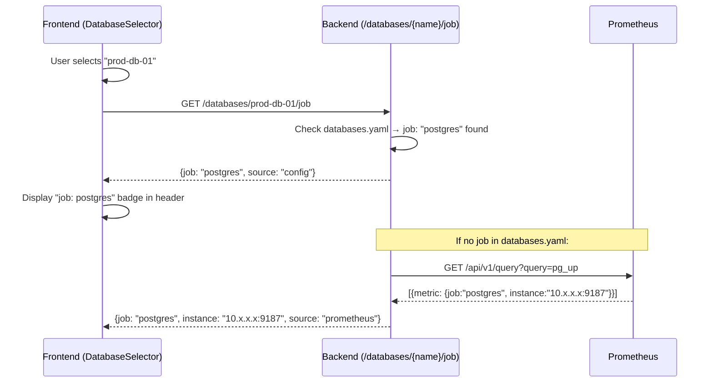

# Auto Job Detection from Prometheus `pg_up` Metrics — Walkthrough

## What Was Implemented

When a user selects a database from the dropdown, the backend automatically identifies the Prometheus **job name** by querying `pg_up` metrics and returns it to the frontend, where it's displayed as a badge in the header.

---

## Changes Made

### Backend

#### [databases.yaml](file:///Users/kanishqk77/Desktop/postgres-ai-agent/backend/databases.yaml)
Added optional `job` field to every database entry (all set to `"postgres"` matching the `pg_up{job="postgres"}` label from the user's environment).

```yaml
databases:
  - name: prod-db-01
    label: "Production DB 01"
    job: "postgres"
  # ... all 50 entries updated
```

#### [config.py](file:///Users/kanishqk77/Desktop/postgres-ai-agent/backend/config.py)
Updated `DatabaseEntry` model to accept the new `job` field:
```python
class DatabaseEntry(BaseModel):
    name: str
    label: str
    job: Optional[str] = None
```

#### [main.py](file:///Users/kanishqk77/Desktop/postgres-ai-agent/backend/main.py)
- Updated `DatabaseItem` response model with `job: Optional[str]`
- Added `JobDetectionResponse` model
- Added `detect_job_from_prometheus()` async helper (queries `pg_up`, matches by instance label)
- Added **`GET /databases/{name}/job`** endpoint with two-step resolution:
  1. Returns `job` from `databases.yaml` if set (`source: "config"`)
  2. Falls back to querying Prometheus `pg_up` (`source: "prometheus"`)
  3. Returns `source: "not_found"` if neither works

### Frontend

#### [api.ts](file:///Users/kanishqk77/Desktop/postgres-ai-agent/frontend/src/lib/api.ts)
- Added `job?: string | null` to `DatabaseItem` interface
- Added `JobDetectionResult` interface
- Added `fetchDatabaseJob(name)` function

#### [DatabaseSelector.tsx](file:///Users/kanishqk77/Desktop/postgres-ai-agent/frontend/src/components/DatabaseSelector.tsx)
- Added `onJobDetected?: (result: JobDetectionResult | null) => void` prop
- On database selection, calls `fetchDatabaseJob()` and passes result to parent

#### [page.tsx](file:///Users/kanishqk77/Desktop/postgres-ai-agent/frontend/src/app/page.tsx)
- Added `detectedJob` and `jobLoading` state
- Passes `onJobDetected` to `DatabaseSelector`
- Displays `job: <name>` badge in the header with "detecting…" loading state

#### [globals.css](file:///Users/kanishqk77/Desktop/postgres-ai-agent/frontend/src/app/globals.css)
Added styles for `.header__job-badge`, `.header__job-tag` (animated pill badge), and `.header__job-loading` (pulsing italic text).

---

## How It Works (Flow)



---

## Verification

### Backend endpoint
```bash
curl http://localhost:8000/databases/prod-db-01/job
# Expected:
# {"database":"prod-db-01","job":"postgres","instance":null,"source":"config"}

curl http://localhost:8000/databases
# Expected: databases array now includes "job":"postgres" for each entry
```

### Frontend UI
1. Select any database from the dropdown
2. Header shows `"detecting…"` briefly, then `job: postgres` badge appears
3. Hovering the badge shows tooltip with full details (instance, source)
