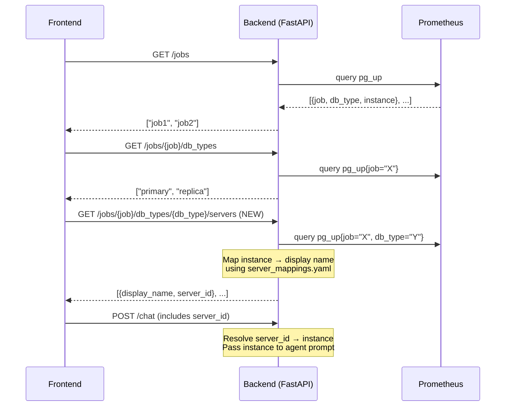

# Database Server Selector — Implementation Plan

Add a third dropdown ("Server") to the frontend header that lets users pick a database server by a **friendly display name**, while internally mapping it to the `instance` label (hostname:port) from Prometheus. The raw hostname/IP is never exposed in the UI.

## Current Selection Flow

```
Database (job) → DB Type → Chat
```

## Proposed Selection Flow

```
Database (job) → DB Type → Server → Chat
```

---

## Architecture



---

## Proposed Changes

### 1. Backend — Server Mapping Config

#### [NEW] `backend/server_mappings.yaml`

A YAML file that maps raw Prometheus `instance` labels to user-friendly display names:

```yaml
servers:
  - instance: "10.0.1.50:9187"
    display_name: "Production Primary"
  - instance: "10.0.1.51:9187"
    display_name: "Production Replica"
  - instance: "10.0.2.10:9187"
    display_name: "Staging Server"
```

- If an instance from Prometheus has no entry in this file, auto-generate a name like `"Server 1"`, `"Server 2"`, etc.
- This keeps hostname/IP completely hidden from the frontend.

#### [MODIFY] `backend/config.py`

Add a loader for `server_mappings.yaml`, similar to the existing `load_databases()`:

```python
class ServerMapping(BaseModel):
    instance: str
    display_name: str

def load_server_mappings() -> Dict[str, str]:
    """Load instance → display_name mappings from server_mappings.yaml."""
    yaml_path = pathlib.Path(__file__).parent / "server_mappings.yaml"
    if not yaml_path.exists():
        return {}
    with open(yaml_path, "r", encoding="utf-8") as f:
        data = yaml.safe_load(f)
    return {s["instance"]: s["display_name"] for s in data.get("servers", [])}
```

---

### 2. Backend — New API Endpoint

#### [MODIFY] `backend/main.py`

**New endpoint**: `GET /jobs/{job_name}/db_types/{db_type}/servers`

```python
class ServerItem(BaseModel):
    server_id: str       # opaque ID (e.g., hashed or indexed)
    display_name: str    # user-friendly name shown in UI

class ServersResponse(BaseModel):
    servers: List[ServerItem]

@app.get("/jobs/{job_name}/db_types/{db_type}/servers")
async def list_servers(job_name: str, db_type: str):
    """Return available servers for a job + db_type, with display names."""
    # 1. Query Prometheus: pg_up{job="X", db_type="Y"}
    # 2. Extract unique 'instance' labels
    # 3. Map each instance to display_name via server_mappings.yaml
    # 4. Auto-generate names for unmapped instances
    # 5. Return [{server_id, display_name}, ...]
```

The `server_id` is an opaque identifier (e.g., base64-encoded instance, or a sequential ID mapped in-memory) so the raw IP never reaches the frontend.

**Modify `POST /chat`**: Add optional `server_id` field to `ChatRequest`:

```python
class ChatRequest(BaseModel):
    message: str
    database: str
    db_type: str
    server_id: Optional[str] = None    # NEW
    conversation_id: Optional[str] = None
    history: Optional[List[HistoryMessage]] = None
```

On the backend, resolve `server_id` → `instance` and pass it to the agent.

---

### 3. Backend — Agent Prompt Update

#### [MODIFY] `backend/agent.py`

Update system prompt to include the resolved instance:

```diff
+ You are monitoring the specific server instance `{instance}`.
+ When constructing PromQL queries, filter by instance="{instance}"
+ to scope results to this specific server.
```

Update `AgentState` and `run_agent()` to accept and use the instance value.

---

### 4. Frontend — New Server Selector Component

#### [NEW] `frontend/src/components/ServerSelector.tsx`

A new dropdown component (same style as `DbTypeSelector`):
- Fetches servers from `GET /jobs/{job}/db_types/{db_type}/servers`
- Displays `display_name` values
- Emits selected `server_id` on change
- Resets when `database` or `dbType` changes

#### [MODIFY] `frontend/src/lib/api.ts`

Add API functions:

```typescript
export interface ServerItem {
    server_id: string;
    display_name: string;
}

export async function fetchServers(
    jobName: string,
    dbType: string
): Promise<ServerItem[]> { ... }
```

Update `sendMessage()` to include `server_id` parameter.

#### [MODIFY] `frontend/src/app/page.tsx`

- Add `server` state and `ServerSelector` in the header
- Reset server when database or dbType changes
- Pass `server_id` in chat requests
- Update status display: `"Production Primary (primary)"` instead of just `"job (db_type)"`

---

## UI Layout

```
┌──────────────────────────────────────────────────────────────┐
│  [Database ▼]  [DB Type ▼]  [Server ▼]    PostgreSQL Agent   │
└──────────────────────────────────────────────────────────────┘
```

The Server dropdown only appears/enables after both Database and DB Type are selected.

---

## Key Design Decisions

| Decision | Rationale |
|----------|-----------|
| `server_mappings.yaml` for naming | Simple, no DB needed; easy for ops to maintain |
| Auto-generated fallback names | Unmapped instances still work without config |
| Opaque `server_id` sent to frontend | Hostname/IP never leaves the backend |
| Server scoping in agent prompt | Agent can filter PromQL by specific instance |

---

## Verification Plan

1. **Add test mappings** to `server_mappings.yaml`
2. **Hit the new endpoint**: `curl http://localhost:8000/jobs/{job}/db_types/{type}/servers`
   - Verify display names appear, no raw IPs
3. **Frontend**: select Database → DB Type → Server and verify the third dropdown populates
4. **Chat**: ask a question and verify the agent scopes queries to the selected instance
5. **Unmapped instance test**: remove a mapping entry and verify auto-naming works
