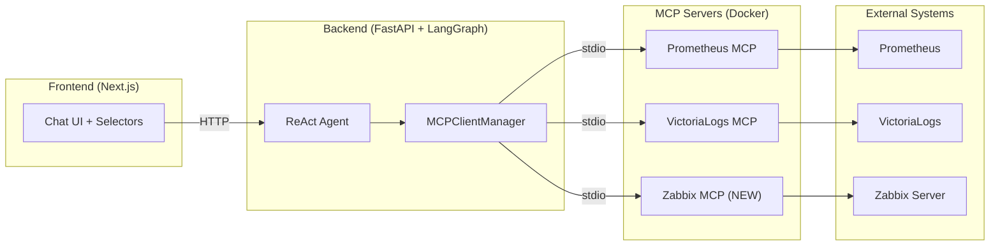

# Zabbix MCP Server Integration Plan

Integrate the [Zabbix MCP Server](https://github.com/mpeirone/zabbix-mcp-server) into the existing PostgreSQL Observability Agent to provide infrastructure-level metrics (CPU, memory, disk I/O, load, network) alongside the existing Prometheus (DB metrics) and VictoriaLogs (log analysis) tools.

## Architecture Overview



The Zabbix MCP server will be added as a **third MCP server** alongside the existing Prometheus and VictoriaLogs servers. The integration follows the exact same pattern already established in the codebase — the `MCPClientManager` spawns it via Docker `stdio` transport and auto-discovers its 40+ tools.

---

## Prerequisites

- A running Zabbix server with the API enabled
- Either a Zabbix API token (recommended) or username/password credentials
- Recommend enabling `READ_ONLY=true` for the Zabbix MCP server in production to prevent accidental modifications

### Docker Image

The Zabbix MCP server Docker image needs to be built or pulled. Options:
1. Clone the repo into `mcp-servers/zabbix-mcp-server/` and build locally
2. Push a pre-built image to Docker Hub and reference it

---

## Proposed Changes

### 1. Environment Variables (`.env` / `.env.example`)

Add Zabbix connection env vars:

```env
# === Zabbix Monitoring ===
ZABBIX_URL=http://your-zabbix-server/api_jsonrpc.php
ZABBIX_TOKEN=your-zabbix-api-token
# Alternative: ZABBIX_USER / ZABBIX_PASSWORD
ZABBIX_READ_ONLY=true
```

---

### 2. Docker Compose (`docker-compose.yml`)

Add the Zabbix MCP server as a new service, and add it to backend's `depends_on`:

```yaml
  # ── Zabbix MCP Server ─────────────────────────────────────
  mcp-zabbix:
    build: ./mcp-servers/zabbix-mcp-server
    # OR: image: zabbix-mcp-server:latest  (if pre-built)
    environment:
      - ZABBIX_URL=${ZABBIX_URL}
      - ZABBIX_TOKEN=${ZABBIX_TOKEN}
      - READ_ONLY=${ZABBIX_READ_ONLY:-true}
    stdin_open: true
    tty: true
```

Add `mcp-zabbix` to backend's `depends_on` list.

---

### 3. Backend Config (`backend/config.py`)

Add Zabbix settings to the `Settings` class:

```python
    # Zabbix
    zabbix_url: str = ""
    zabbix_token: str = ""
    zabbix_user: str = ""
    zabbix_password: str = ""
    zabbix_read_only: bool = True
```

---

### 4. Backend Agent (`backend/agent.py`)

#### 4a. Add Zabbix MCP client in `MCPClientManager.initialize()`

Following the exact same pattern as Prometheus and VictoriaLogs — spawn via Docker stdio:

```python
# --- Zabbix MCP Server ---
try:
    zabbix_env = {
        **os.environ,
        "ZABBIX_URL": settings.zabbix_url,
        "READ_ONLY": str(settings.zabbix_read_only).lower(),
    }
    # Use token auth if available, else user/pass
    if settings.zabbix_token:
        zabbix_env["ZABBIX_TOKEN"] = settings.zabbix_token
    else:
        zabbix_env["ZABBIX_USER"] = settings.zabbix_user
        zabbix_env["ZABBIX_PASSWORD"] = settings.zabbix_password

    zbx_params = StdioServerParameters(
        command="docker",
        args=[
            "run", "-i", "--rm",
            "-e", "ZABBIX_URL",
            "-e", "ZABBIX_TOKEN",
            "-e", "ZABBIX_USER",
            "-e", "ZABBIX_PASSWORD",
            "-e", "READ_ONLY",
            "zabbix-mcp-server:latest",
        ],
        env=zabbix_env,
    )
    zbx_transport = await self._exit_stack.enter_async_context(
        stdio_client(zbx_params)
    )
    zbx_read, zbx_write = zbx_transport
    zbx_session = await self._exit_stack.enter_async_context(
        ClientSession(zbx_read, zbx_write)
    )
    await zbx_session.initialize()
    self._sessions["zabbix"] = zbx_session
    logger.info("✅ Zabbix MCP server connected")
except Exception as e:
    logger.warning(f"⚠️  Zabbix MCP server failed to start: {e}")
```

#### 4b. Update System Prompt

Extend `SYSTEM_PROMPT_TEMPLATE` to include Zabbix as a third tool category:

```
You have three categories of tools:
1. **Prometheus tools** — for querying PostgreSQL metrics (PromQL).
2. **VictoriaLogs tools** — for querying PostgreSQL logs (LogsQL).
3. **Zabbix tools** — for querying infrastructure-level metrics from Zabbix
   (CPU utilization, memory usage, disk I/O, network, load average,
   active problems, triggers, host status, etc.).

Key infrastructure metrics you can investigate via Zabbix:
- Host status: availability, uptime, active problems
- CPU: utilization, load average, iowait
- Memory: total, used, available, swap usage
- Disk: I/O read/write, disk space, inode usage
- Network: interface throughput, packet errors
- Active problems and trigger history
- Maintenance windows

When diagnosing database performance issues, correlate:
- Prometheus (DB-level metrics) + VictoriaLogs (logs) + Zabbix (infra metrics)
to provide a holistic root cause analysis.
```

---

### 5. Frontend Changes (minimal)

The frontend changes are minimal because the agent dynamically discovers tools and the UI already supports displaying tool calls generically.

- **`page.tsx`**: Update header title to "PostgreSQL Observability Agent"
- **`ChatWindow.tsx`**: Add Zabbix-related suggestion prompts (e.g., "What is the CPU and memory utilization of the DB host?")
- **`ToolCallTrace.tsx`**: Add Zabbix icon (`🔌`) for tool calls prefixed with `zabbix__`

---

## Verification Plan

1. **Docker Compose validation**: `docker compose config`
2. **Backend startup**: Check logs for `✅ Zabbix MCP server connected`
3. **Test queries**:
   - *"What Zabbix hosts are monitored?"* → `zabbix__host_get`
   - *"Show CPU utilization of the DB host"* → Zabbix history/item tools
   - *"Are there any active problems?"* → `zabbix__problem_get`
4. **Holistic query**: *"Why is the database slow?"* → should use tools from all three MCP servers

> **Note:** The backend gracefully handles the case where the Zabbix MCP server fails to start, matching the existing pattern for Prometheus and VictoriaLogs.
